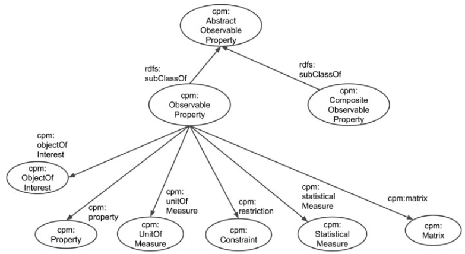

Markdown documentation created by [pyLODE](http://github.com/rdflib/pyLODE) 2.8.3

# Complex Property Model ontology
        

## Metadata
* **URI**
  * `http://purl.org/voc/cpm`
* **Ontology RDF**
  * RDF ([data_file.ttl](turtle))
### Description

An OWL representation of the Complex Property Model (CPM).

The ontology here encodes the CPM defined in the INSPIRE guidelines for Observations &amp; Measurements and Sensor Web Enablement-related standards document.

## Table of Contents
1. [Classes](#classes)
1. [Object Properties](#objectproperties)
1. [Datatype Properties](#datatypeproperties)
1. [Annotation Properties](#annotationproperties)
1. [Namespaces](#namespaces)
1. [Legend](#legend)

## Overview

**Figure 1:** Ontology overview
## Classes
[Abstract Observable Property](#AbstractObservableProperty),
[Composite Observable Property](#CompositeObservableProperty),
[Constraint](#Constraint),
[Matrix](#Matrix1),
[Object of Interest](#ObjectOfInterest),
[Observable Property](#ObservableProperty),
[Phenomenon](#Phenomenon),
[Property](#Property),
[Statistical Measure](#StatisticalMeasure1),
[Substance](#Substance),
[Taxon](#Taxon),
### Abstract Observable Property
Property | Value
--- | ---
URI | `http://purl.org/voc/cpm#AbstractObservableProperty`
Description | 
The AbstractObservableProperty class is the root of the ObservableProperty model. It is implemented  by two specialisations: ObservableProperty and CompositeObservableProperty.

Super-classes |[skos:Concept](http://www.w3.org/2004/02/skos/core#Concept) (c) 
Sub-classes |[CompositeObservableProperty](CompositeObservableProperty) (c) [ObservableProperty](ObservableProperty) (c) 
In range of |[component](component) (op) 
### Composite Observable Property
Property | Value
--- | ---
URI | `http://purl.org/voc/cpm#CompositeObservableProperty`
Description | 
Usually, when performing multiple observations on one featureOfInterest, one provides a separate ObservableProperty element for each Phenomenon being observed. However, in certain cases where either a) there is a strong link between the Phenomena or b) the multiple phenomena are clearly observed as part of the same Observation, these Phenomena may be provided together in one Observation. In this case a CompositeObservableProperty can be defined that groups together multiple Phenomena (ObservableProperty) into one CompositeObservableProperty element. 
 
An example of a strongly linked pair of Phenomena is wind speed and wind direction

Super-classes |[AbstractObservableProperty](AbstractObservableProperty) (c) [skos:Concept](http://www.w3.org/2004/02/skos/core#Concept) (c) 
Restrictions |[count](count) (dp) **exactly** 1 [component](component) (op) **min** 2 
In domain of |[component](component) (op) [count](count) (dp) 
### Constraint
Property | Value
--- | ---
URI | `http://purl.org/voc/cpm#Constraint`
Description | 
In order to provide other constraints on ObservableProperties, the type Constraint has been created and can be associated with an ObservableProperty. Constraints may be specialised or the simple description attribute may be used to provide a free text description of the constraint. 

Super-classes |[skos:Concept](http://www.w3.org/2004/02/skos/core#Concept) (c) 
Restrictions |[constraintProperty](ConstrainedProperty) (op) **max** 1 [label](label) (dp) **min** 0 [label](label) (dp) **max** 1 [constraintProperty](ConstrainedProperty) (op) **min** 0 
In domain of |[label](label) (dp) [constraintProperty](ConstrainedProperty) (op) 
In range of |[restriction](restriction) (op) 
### Matrix
Property | Value
--- | ---
URI | `http://purl.org/voc/cpm#Matrix`
Description | 
The matrix is a special case of a feature-of-interest that provides the context (container feeaure or medium) for an observable property.

Super-classes |[skos:Concept](http://www.w3.org/2004/02/skos/core#Concept) (c) 
In range of |[matrix](Matrix) (op) 
### Object of Interest
Property | Value
--- | ---
URI | `http://purl.org/voc/cpm#ObjectOfInterest`
Description | 
The substance, taxon or other physical/chemical phenomenon of the Feature Of Interest that is being observed. E.g.  Waves, Rainfall, Calluna Vulgaris, Aluminium.

Super-classes |[skos:Concept](http://www.w3.org/2004/02/skos/core#Concept) (c) 
Sub-classes |[Taxon](Taxon) (c) [Phenomenon](Phenomenon) (c) [Substance](Substance) (c) 
In range of |[objectOfInterest](ObjectofInterest) (op) 
### Observable Property
Property | Value
--- | ---
URI | `http://purl.org/voc/cpm#ObservableProperty`
Description | 
At its simplest an ObservableProperty simply carries a reference to a phenomenon definition in a codelist with optional units of measure. However an ObservableProperty definition may be augmented using Constraints and/or Statistical Measures to create a more full definition of the observed property. 

Super-classes |[skos:Concept](http://www.w3.org/2004/02/skos/core#Concept) (c) [AbstractObservableProperty](AbstractObservableProperty) (c) 
Restrictions |[statisticalMeasure](StatisticalMeasure) (op) **min** 0 [property](property) (op) **exactly** 1 [Property](Property) (c) [opUnitOfMeasure](http://purl.org/voc/cpm#opUnitOfMeasure) **min** 0 [opUnitOfMeasure](http://purl.org/voc/cpm#opUnitOfMeasure) **max** 1 [restriction](restriction) (op) **min** 0 [objectOfInterest](ObjectofInterest) (op) **min** 1 [ObjectOfInterest](ObjectOfInterest) (c) 
In domain of |[unitOfMeasure](unitofmeasure) (op) [objectOfInterest](ObjectofInterest) (op) [restriction](restriction) (op) [canonicalUnit](canonicalunit) (op) [matrix](Matrix) (op) [statisticalMeasure](StatisticalMeasure) (op) [property](property) (op) 
### Phenomenon
Property | Value
--- | ---
URI | `http://purl.org/voc/cpm#Phenomenon`
Description | 
A specialisation of ObjectOfInterest for use where the Object of Interest is a physical phenomen, such as "throughfall" or "waves"

Super-classes |[ObjectOfInterest](ObjectOfInterest) (c) [skos:Concept](http://www.w3.org/2004/02/skos/core#Concept) (c) 
### Property
Property | Value
--- | ---
URI | `http://purl.org/voc/cpm#Property`
Description | 
The property of the environment which the ObservableProperty is describing.

Super-classes |[skos:Concept](http://www.w3.org/2004/02/skos/core#Concept) (c) 
In range of |[property](property) (op) 
### Statistical Measure
Property | Value
--- | ---
URI | `http://purl.org/voc/cpm#StatisticalMeasure`
Description | <pre><code>        A description of some statistical measure e.g. "daily maximum". The measure is usually some function over some time (e.g. an hour, a day) or space (e.g. a length, area or volume). Other aggregation types can be supported by the 'otherAggregation' extension point. </code></pre>
Super-classes |[skos:Concept](http://www.w3.org/2004/02/skos/core#Concept) (c) 
Restrictions |[derivedFrom](derivedFrom) (op) **max** 1 [aggregationVolume](aggregationVolume) (op) **min** 0 [aggregationArea](aggregationArea) (op) **min** 0 [otherAggregation](otherAggregation) (op) **max** 1 [aggregationTimePeriod](aggregationTimePeriod) (op) **max** 1 [aggregationTimePeriod](aggregationTimePeriod) (op) **min** 0 [aggregationVolume](aggregationVolume) (op) **max** 1 [aggregationLength](aggregationLength) (op) **max** 1 [aggregationLength](aggregationLength) (op) **min** 0 [derivedFrom](derivedFrom) (op) **min** 0 [otherAggregation](otherAggregation) (op) **min** 0 [aggregationArea](aggregationArea) (op) **max** 1 [label](label) (dp) **max** 1 [label](label) (dp) **min** 0 
In domain of |[label](label) (dp) [aggregation](aggregation) (op) [derivedFrom](derivedFrom) (op) 
In range of |[derivedFrom](derivedFrom) (op) [statisticalMeasure](StatisticalMeasure) (op) 
### Substance
Property | Value
--- | ---
URI | `http://purl.org/voc/cpm#Substance`
Description | 
A specialisation of ObjectOfInterest for use where the Object of Interest is a chemical substance

Super-classes |[skos:Concept](http://www.w3.org/2004/02/skos/core#Concept) (c) [ObjectOfInterest](ObjectOfInterest) (c) 
Restrictions |[casNumber](CASNumber) (dp) **min** 0 
In domain of |[casNumber](CASNumber) (dp) 
### Taxon
Property | Value
--- | ---
URI | `http://purl.org/voc/cpm#Taxon`
Description | 
A specialisation of ObjectOfInterest for use where the Object of Interest is an organism with a binomial classification

Super-classes |[ObjectOfInterest](ObjectOfInterest) (c) [skos:Concept](http://www.w3.org/2004/02/skos/core#Concept) (c) 

## Object Properties
[aggregation](#aggregation),
[aggregationArea](#aggregationArea),
[aggregationLength](#aggregationLength),
[aggregationTimePeriod](#aggregationTimePeriod),
[aggregationVolume](#aggregationVolume),
[canonical unit](#canonicalunit),
[component](#component),
[Constrained Property](#ConstrainedProperty),
[derivedFrom](#derivedFrom),
[Matrix](#Matrix),
[Object of Interest](#ObjectofInterest),
[otherAggregation](#otherAggregation),
[property](#property),
[restriction](#restriction),
[Statistical Measure](#StatisticalMeasure),
[unit of measure](#unitofmeasure),
[related](#related),

### aggregation
Property | Value
--- | ---
URI | `http://purl.org/voc/cpm#aggregation`
Super-properties |[skos:related](http://www.w3.org/2004/02/skos/core#related) (op) 
Domain(s) |[StatisticalMeasure](StatisticalMeasure1) (c) 
Range(s) |[xsd:anyURI](http://www.w3.org/2001/XMLSchema#anyURI) (c) 

### aggregationArea
Property | Value
--- | ---
URI | `http://purl.org/voc/cpm#aggregationArea`
Super-properties |[aggregation](aggregation) (op) [skos:related](http://www.w3.org/2004/02/skos/core#related) (op) 

### aggregationLength
Property | Value
--- | ---
URI | `http://purl.org/voc/cpm#aggregationLength`
Super-properties |[skos:related](http://www.w3.org/2004/02/skos/core#related) (op) [aggregation](aggregation) (op) 

### aggregationTimePeriod
Property | Value
--- | ---
URI | `http://purl.org/voc/cpm#aggregationTimePeriod`
Super-properties |[aggregation](aggregation) (op) [skos:related](http://www.w3.org/2004/02/skos/core#related) (op) 

### aggregationVolume
Property | Value
--- | ---
URI | `http://purl.org/voc/cpm#aggregationVolume`
Super-properties |[skos:related](http://www.w3.org/2004/02/skos/core#related) (op) [aggregation](aggregation) (op) 

### canonical unit
Property | Value
--- | ---
URI | `http://purl.org/voc/cpm#canonicalUnit`
Super-properties |[unitOfMeasure](unitofmeasure) (op) [skos:related](http://www.w3.org/2004/02/skos/core#related) (op) 
Domain(s) |[ObservableProperty](ObservableProperty) (c) 

### component
Property | Value
--- | ---
URI | `http://purl.org/voc/cpm#component`
Super-properties |[skos:related](http://www.w3.org/2004/02/skos/core#related) (op) 
Domain(s) |[CompositeObservableProperty](CompositeObservableProperty) (c) 
Range(s) |[AbstractObservableProperty](AbstractObservableProperty) (c) 

### Constrained Property
Property | Value
--- | ---
URI | `http://purl.org/voc/cpm#constraintProperty`
Super-properties |[property](property) (op) [skos:related](http://www.w3.org/2004/02/skos/core#related) (op) 
Domain(s) |[Constraint](Constraint) (c) 
Range(s) |[xsd:anyURI](http://www.w3.org/2001/XMLSchema#anyURI) (c) 

### derivedFrom
Property | Value
--- | ---
URI | `http://purl.org/voc/cpm#derivedFrom`
Super-properties |[skos:related](http://www.w3.org/2004/02/skos/core#related) (op) 
Domain(s) |[StatisticalMeasure](StatisticalMeasure1) (c) 
Range(s) |[StatisticalMeasure](StatisticalMeasure1) (c) 

### Matrix
Property | Value
--- | ---
URI | `http://purl.org/voc/cpm#matrix`
Super-properties |[skos:related](http://www.w3.org/2004/02/skos/core#related) (op) 
Domain(s) |[ObservableProperty](ObservableProperty) (c) 
Range(s) |[Matrix](Matrix1) (c) 

### Object of Interest
Property | Value
--- | ---
URI | `http://purl.org/voc/cpm#objectOfInterest`
Super-properties |[skos:related](http://www.w3.org/2004/02/skos/core#related) (op) 
Domain(s) |[ObservableProperty](ObservableProperty) (c) 
Range(s) |[ObjectOfInterest](ObjectOfInterest) (c) 

### otherAggregation
Property | Value
--- | ---
URI | `http://purl.org/voc/cpm#otherAggregation`
Super-properties |[aggregation](aggregation) (op) 

### property
Property | Value
--- | ---
URI | `http://purl.org/voc/cpm#property`
Super-properties |[skos:related](http://www.w3.org/2004/02/skos/core#related) (op) 
Domain(s) |[ObservableProperty](ObservableProperty) (c) 
Range(s) |[Property](Property) (c) [xsd:anyURI](http://www.w3.org/2001/XMLSchema#anyURI) (c) 

### restriction
Property | Value
--- | ---
URI | `http://purl.org/voc/cpm#restriction`
Super-properties |[skos:related](http://www.w3.org/2004/02/skos/core#related) (op) 
Domain(s) |[ObservableProperty](ObservableProperty) (c) 
Range(s) |[Constraint](Constraint) (c) 

### Statistical Measure
Property | Value
--- | ---
URI | `http://purl.org/voc/cpm#statisticalMeasure`
Super-properties |[skos:related](http://www.w3.org/2004/02/skos/core#related) (op) 
Domain(s) |[ObservableProperty](ObservableProperty) (c) 
Range(s) |[xsd:anyURI](http://www.w3.org/2001/XMLSchema#anyURI) (c) [StatisticalMeasure](StatisticalMeasure1) (c) 

### unit of measure
Property | Value
--- | ---
URI | `http://purl.org/voc/cpm#unitOfMeasure`
Super-properties |[skos:related](http://www.w3.org/2004/02/skos/core#related) (op) 
Domain(s) |[ObservableProperty](ObservableProperty) (c) 

### related
Property | Value
--- | ---
URI | `http://www.w3.org/2004/02/skos/core#related`

## Datatype Properties
[CAS Number](#CASNumber),
[count](#count),
[label](#label),
[value](#value),
[altLabel](#altLabel),
[prefLabel](#prefLabel),

### CAS Number
Property | Value
--- | ---
URI | `http://purl.org/voc/cpm#casNumber`
Super-properties |[skos:altLabel](http://www.w3.org/2004/02/skos/core#altLabel) (dp) 
Domain(s) |[Substance](Substance) (c) 
Range(s) |[xsd:string](http://www.w3.org/2001/XMLSchema#string) (c) 

### count
Property | Value
--- | ---
URI | `http://purl.org/voc/cpm#count`
Domain(s) |[CompositeObservableProperty](CompositeObservableProperty) (c) 
Range(s) |[xsd:nonNegativeInteger](http://www.w3.org/2001/XMLSchema#nonNegativeInteger) (c) 

### label
Property | Value
--- | ---
URI | `http://purl.org/voc/cpm#label`
Super-properties |[skos:prefLabel](http://www.w3.org/2004/02/skos/core#prefLabel) (dp) 
Domain(s) |[StatisticalMeasure](StatisticalMeasure1) (c) [Constraint](Constraint) (c) 
Range(s) |[xsd:string](http://www.w3.org/2001/XMLSchema#string) (c) 

### value
Property | Value
--- | ---
URI | `http://purl.org/voc/cpm#value`

### altLabel
Property | Value
--- | ---
URI | `http://www.w3.org/2004/02/skos/core#altLabel`

### prefLabel
Property | Value
--- | ---
URI | `http://www.w3.org/2004/02/skos/core#prefLabel`

## Annotation Properties
[definition](#definition),
[notation](#notation),

### definition
Property | Value
--- | ---
URI | `http://www.w3.org/2004/02/skos/core#definition`

### notation
Property | Value
--- | ---
URI | `http://www.w3.org/2004/02/skos/core#notation`

## Named Individuals
## Namespaces
* **:**
  * `http://purl.org/voc/cpm#`
* **owl**
  * `http://www.w3.org/2002/07/owl#`
* **prov**
  * `http://www.w3.org/ns/prov#`
* **rdf**
  * `http://www.w3.org/1999/02/22-rdf-syntax-ns#`
* **rdfs**
  * `http://www.w3.org/2000/01/rdf-schema#`
* **sdo**
  * `https://schema.org/`
* **skos**
  * `http://www.w3.org/2004/02/skos/core#`
* **vann**
  * `http://purl.org/vocab/vann/`
* **xsd**
  * `http://www.w3.org/2001/XMLSchema#`

## Legend
* Classes: c
* Object Properties: op
* Functional Properties: fp
* Data Properties: dp
* Annotation Properties: dp
* Properties: p
* Named Individuals: ni
